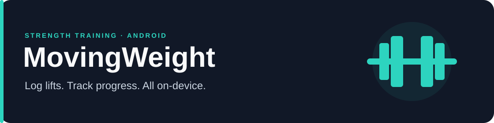

# MovingWeight



<p align="center">
  <strong>Android-first · No account required · Your training stays on your device</strong>
</p>

MovingWeight is a strength training tracker for the work you do in the gym. Start a session, record your sets, and watch your lifts progress over time. Keep it spontaneous or follow a plan across several weeks.

## From your first set to your next training block

### Log while you lift

Start an empty workout or pick a saved template. Record reps and weight, check off the sets you perform, and finish when you're done.

Your unfinished session saves as you edit, so you can leave and pick up where you stopped—even after restarting the app. Bodyweight exercises work too: zero added weight is valid.

### Give your training a plan

Save your regular sessions as **workout templates**, with exercises and default sets ready to go.

For longer programs, build a **multi-week training block** with an ordered sequence of workouts. Set focus lifts as percentages of your training max, add accessory work, and duplicate sessions to build your split faster. Once a block starts, its plan stays stable even if you edit the reusable version.

### See the progress you've earned

Open an exercise to chart your **heaviest completed weight and the reps you lifted**, or switch to volume to review workload. Your workout history keeps the details behind each session.

Keep your library tidy by archiving exercises you no longer use. Their history stays intact, and you can restore them later.

## Make it yours

Build your own exercise library with notes and cues. Choose **Midnight**, **Forest**, or **Ember** in Settings for a dark theme with teal, lime, or orange accents.

## Try it on Android

[**Build and install MovingWeight →**](docs/android-build.md)

The setup guide covers the required tools, secure signing key storage, and installation over USB. Once configured, building and installing are two commands:

```bash
bun run apk
bun run apk:install
```

The standalone app runs without Expo Go or a development server. Updates check signing compatibility before installation to help preserve your existing data.

For your first workout:

1. Tap **Start empty workout** on Home.
2. Add an exercise, enter your reps and weight, and check off the sets you complete.
3. Tap **Finish**, then find the session in History and your lift's progress on its exercise page.

## Your workouts, on your device

MovingWeight stores your training data locally. There is no sign-in or cloud sync, and your training history is not uploaded to a server.

---

Built with **Expo, React Native, TypeScript, and SQLite**. For local development and verification, see the [developer guide](docs/android-build.md#develop-locally).
